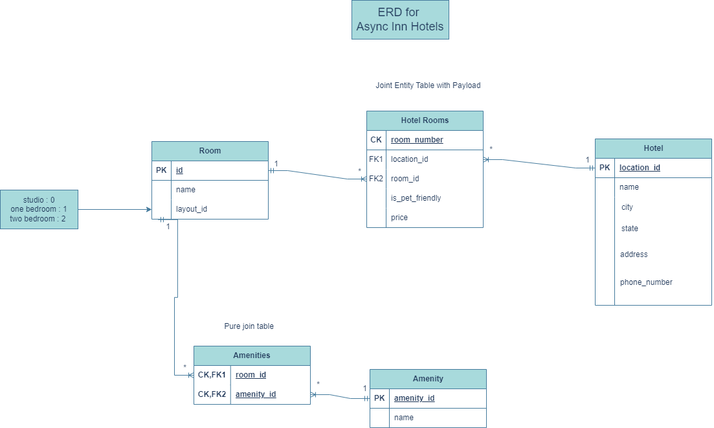
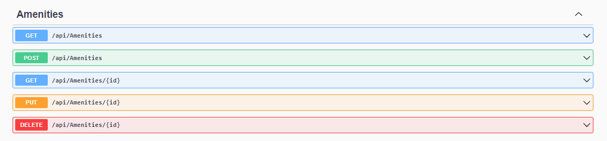
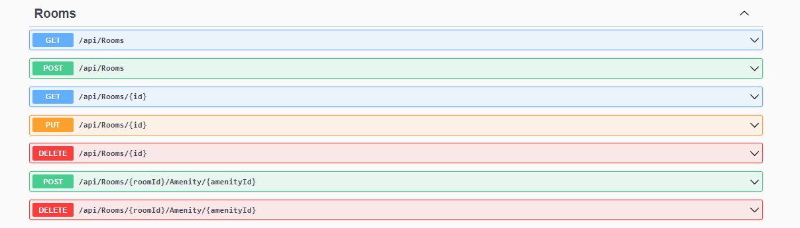
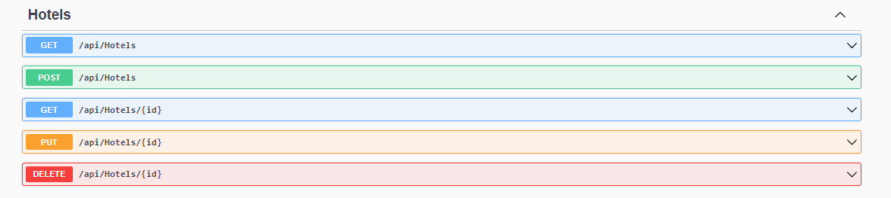
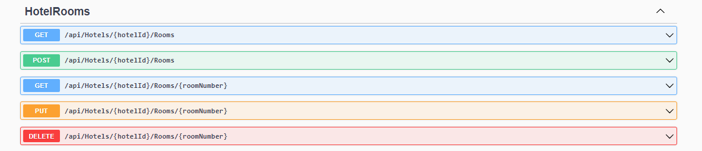

# Async-Inn

## Name: Hadeel Lafi

## Date: 16/07/2023

## ERD



### Tables Explanation

**Hotel:** Holds the details of the hotel. It has `location_id` as every hotel has a unique location, along with other required data such as name, city, state, address, and phone number. It is linked with rooms through a many-to-many relationship, for which we create a `Hotel Rooms` table.

**Room:** Each room has an `id` as the primary key, and additional fields include `name` and `layout_id`. The `layout_id` contains a number from an `enum` that represents the types of rooms (studio, one room, two rooms). The table has a many-to-many relationship with hotels, as multiple hotels can have multiple rooms. Therefore, we create the `Hotel Rooms` table.

**Hotel Rooms:** This is a join entity table that includes the foreign keys `location_id` from the `Hotel` table and `room_id` from the `Room` table. These two keys are set as the composite key for the table. Additionally, the table has two more fields: `is_pet_friendly` and `price`.

**Amenity:** This table holds the `amenity_id` as the primary key and the name of the amenity that rooms have. The relationship between rooms and amenities is many-to-many, as multiple rooms can have multiple amenities. For this purpose, we create the `Amenities` table.

**Amenities:** This is a pure join table. It only has two primary keys: one from the `Room` table and the other from the `Amenity` table. Together, these keys act as a composite key.

## App architecture

In the initial version of the application, the presentation layer (controllers) directly handled data access and database interactions, which is not considered a best practice. To solve this issue, I refactored the code to follow the Repository design pattern. By implementing interfaces representing data resources like `IAmenity` and `IHotel`, we created a separation between the presentation layer and data access logic. Now, the presentation layer relies on these interfaces to interact with data, promoting a more organized and decoupled codebase. This pattern enhances maintainability and testability.

### RoomAmenity Routes

- **Add Amenity to Room**

  POST: `https://localhost:7004/api/Rooms/4/Amenity/2`

  Request Body:
  ```json
  {
      "name": "new",
      "roomLayout": 0
  }
  ```

  - **Note**: There is no output, but in case the `amenityId` or `roomId` is not found, the output will be `Room or Amenity not found.`

- **Delete Amenity from Room**

  DELETE: `https://localhost:7004/api/Rooms/2/Amenity/2`

  - **Note**: There is no output, but in case the `amenityId` or `roomId` is not found, the output will be `Room or Amenity not found.`

- **Get All Rooms**

  GET: `https://localhost:7004/api/Rooms`

  Output:
  ```json
  [
      {
          "id": 2,
          "name": "Room 2",
          "roomLayout": 1,
          "roomAmenities": [
              {
                  "roomId": 2,
                  "amenityId": 2,
                  "amenity": {
                      "id": 2,
                      "name": "Amenity 2",
                      "roomAmenities": [
                          {
                              "roomId": 3,
                              "amenityId": 2,
                              "room": {
                                  "id": 3,
                                  "name": "Room 3",
                                  "roomLayout": 2,
                                  "roomAmenities": [],
                                  "hotelRooms": null
                              }
                          }
                      ]
                  }
              }
          ],
          "hotelRooms": null
      },
      {
          "id": 3,
          "name": "Room 3",
          "roomLayout": 2,
          "roomAmenities": [
              {
                  "roomId": 3,
                  "amenityId": 2,
                  "amenity": {
                      "id": 2,
                      "name": "Amenity 2",
                      "roomAmenities": [
                          {
                              "roomId": 2,
                              "amenityId": 2,
                              "room": {
                                  "id": 2,
                                  "name": "Room 2",
                                  "roomLayout": 1,
                                  "roomAmenities": [],
                                  "hotelRooms": null
                              }
                          }
                      ]
                  }
              }
          ],
          "hotelRooms": null
      },
      {
          "id": 4,
          "name": "new",
          "roomLayout": 0,
          "roomAmenities": [],
          "hotelRooms": null
      }
  ]
  ```

- **Get Room By Id**

  GET: `https://localhost:7004/api/Rooms/2`

  Output:
  ```json
  {
      "id": 2,
      "name": "Room 2",
      "roomLayout": 1,
      "roomAmenities": [
          {
              "roomId": 2,
              "amenityId": 2,
              "amenity": {
                  "id": 2,
                  "name": "Amenity 2",
                  "roomAmenities": []
              }
          }
      ],
      "hotelRooms": null
  }
  ```

### Update Room

- **Update Room by Id**

  PUT: `https://localhost:7004/api/Rooms/5`

  Request Body:
  ```json
  {
      "id": 5,
      "name": "update Room 1",
      "roomLayout": 0
  }
  ```

  Output:
  ```json
  {
      "id": 5,
      "name": "update Room 1",
      "roomLayout": 0,
      "roomAmenities": null,
      "hotelRooms": null
  }
  ```

### Amenity Routes

- **Get Amenity by Id**

  GET: `https://localhost:7004/api/Amenities/2`

  Output:
  ```json{
    "id": 2,
    "name": "Amenity 2",
    "roomAmenities": [
        {
            "roomId": 2,
            "amenityId": 2,
            "room": {
                "id": 2,
                "name": "Room 2",
                "roomLayout": 1,
                "roomAmenities": [],
                "hotelRooms": null
            }
        },
        {
            "roomId": 3,
            "amenityId": 2,
            "room": {
                "id": 3,
                "name": "Room 3",
                "roomLayout": 2,
                "roomAmenities": [],
                "hotelRooms": null
            }
        },
        {
            "roomId": 4,
            "amenityId": 2,
            "room": {
                "id": 4,
                "name": "new",
                "roomLayout": 0,
                "roomAmenities": [],
                "hotelRooms": null
            }
        }
    ]
} ```
  
### Hotel Room Routes

- **Get All Rooms for Specific Hotel**

  GET: `https://localhost:7004/api/Hotels/1/Rooms`

  Output:
  ```json
  [
      {
          "hotelId": 1,
          "roomNumber": 1,
          "roomId": 4,
          "isPetFriendly": true,
          "rate": 5.00,
          "room": null,
          "hotel": null
      },
      {
          "hotelId": 1,
          "roomNumber": 2,
          "roomId": 4,
          "isPetFriendly": true,
          "rate": 5.00,
          "room": null,
          "hotel": null
      },
      {
          "hotelId": 1,
          "roomNumber": 3,
          "roomId": 4,
          "isPetFriendly": false,
          "rate": 5.00,
          "room": null,
          "hotel": null
      },
      {
          "hotelId": 1,
          "roomNumber": 101,
          "roomId": 2,
          "isPetFriendly": true,
          "rate": 150.00,
          "room": null,
          "hotel": null
      }
  ]
  ```

- **Get Hotel Room by Id**

  GET: `https://localhost:7004/api/Hotels/1/Rooms/1`

  Output:
  ```json
  {
      "hotelId": 1,
      "roomNumber": 1,
      "roomId": 4,
      "isPetFriendly": true,
      "rate": 5.00,
      "room": {
          "id": 4,
          "name": "new",
          "roomLayout": 0,
          "roomAmenities": [
              {
                  "roomId": 4,
                  "amenityId": 2,
                  "amenity": {
                      "id": 2,
                      "name": "Amenity 2",
                      "roomAmenities": []
                  }
              }
          ],
          "hotelRooms": []
      },
      "hotel": null
  }
  ```

- **Update Specific Hotel Room**

  PUT: `https://localhost:7004/api/Hotels/1/Rooms/3`

  Request Body:
  ```json
  {
      "hotelId": 1,
      "roomNumber": 3,
      "roomId": 4,
      "isPetFriendly": false,
      "rate": 5.00
  }
  ```

  Output:
  ```json
  {
      "hotelId": 1,
      "roomNumber": 3,
      "roomId": 4,
      "isPetFriendly": false,
      "rate": 5.00,
      "room": null,
      "hotel": null
  }
  ```

- **Add Room to Hotel**


  POST: `https://localhost:7004/api/Hotels/1/Rooms`

  Request Body:
  ```json
  {
      "hotelId": 1,
      "roomNumber": 3,
      "roomId": 4,
      "isPetFriendly": true,
      "rate": 5.00
  }
  ```

  Output:
  ```json
  {
      "hotelId": 1,
      "roomNumber": 3,
      "roomId": 4,
      "isPetFriendly": true,
      "rate": 5.00,
      "room": {
          "id": 4,
          "name": "new",
          "roomLayout": 0,
          "roomAmenities": null,
          "hotelRooms": []
      },
      "hotel": null
  }
  ```

- **Remove Specific Room from Hotel**

  DELETE: `https://localhost:7004/api/Hotels/1/Rooms/3`

## Routes by Swagger

**Amenities Routes**



**Room Routes**



**Hotel Routes**



**Hotel Room Routes**



## Unit testing

The unit tests are written to test the functionality of various services in the Async Inn application.

### Mock Class

Using Mock class allows the tests to have a consistent and isolated environment for interacting with the database. It enables the tests to focus on specific scenarios without affecting the actual database.

The methods in the `Mock` class and their purposes:

1. **CreateAndSaveTestAmenity:**
   - Purpose: Creates a new `Amenity` .
   - Returns: The created `Amenity` entity.

2. **CreateAndSaveTestRoom:**
   - Purpose: Creates a new `Room` entity.
   - Returns: The created `Room` entity.

3. **CreateAndSaveTestHotel:**
   - Purpose: Creates a new `Hotel` entity.
   - Returns: The created `Hotel` entity.

4. **Dispose:**
   - Purpose: Implements the `Dispose` method from the `IDisposable` interface. It ensures that the in-memory database (`_db`) and connection (`_connection`) are properly disposed of after each test is executed.

These methods serve as helper functions in the testing process.

### test Cases

The tests cover CRUD operations and other methods of the services, ensuring that they work as expected.


1. `CanGetRoomById`: Tests the `GetById` method of the `RoomService`. It verifies that a room can be retrieved by its ID.

2. `CanUpdateRoom`: Tests the `Update` method of the `RoomService`. It checks whether a room can be successfully updated with new information.

3. `CanAddAminentyToRoom`: Tests the `AddAmenityToRoom` method of the `RoomService`. It ensures that an amenity can be added to a room .

4. `CanRemoveAmenityFromRoom`: Tests the `RemoveAmenityFromRoom` method of the `RoomService`. It verifies that an amenity can be removed from a room.

5. `CanCreateHotelRoom`: Tests the `Create` method of the `HotelRoomRepository`. It checks whether a hotel room can be successfully created and stored in the database.

6. `CanDeleteHotelRoom`: Tests the `Delete` method of the `HotelRoomRepository`. It verifies that a hotel room can be deleted from the database.

7. `CanUpdateHotelRoom`: Tests the `Update` method of the `HotelRoomRepository`. It ensures that a hotel room can be successfully updated with new information.


